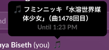

# Web Scrobbler Slack Status

This program will listen to Web Scrobbler events and automatically update your slack status with what you are listening to.

## Setup

1. [Download Web Scrobbler browser extension](https://web-scrobbler.com/)
2. Optional but highly recommended: Create a [last.fm](https://www.last.fm/) account for accurate song play counts, and link it to Web Scrobbler in its settings.
3. Create a slack app [here](https://api.slack.com/apps) with the following manifest: 

App Manifest
`{"display_information":{"name":"Web Scrobbler Slack Status"},"oauth_config":{"redirect_urls":["https://localhost:7188/auth"],"scopes":{"user":["users.profile:write"]}},"settings":{"org_deploy_enabled":false,"socket_mode_enabled":false,"token_rotation_enabled":false}}`

4. Go to "Basic Information" in the Slack app you just made and fill in the following in `config.example.json`
   1. `client_id`: Client ID
   2. `client_secret`: Client Secret
   3. leave access_token empty
5. Rename `config.example.json` to `config.json`
6. Download and install npm and nodejs from [here](https://nodejs.org/en)
7. Run `npx local-ssl-proxy --source 7188 --target 8564` in terminal.
8. Install Go from [here](https://go.dev/doc/install)
9. Open terminal in this folder and run `go run cmd/scrobble-status/main.go`.
10. On first launch, you will be taken to slack to authorize the application, please do so.
11. Check your terminal to see the URL to link with Web Scrobbler.

Once everything is linked, listen to music in your browser [(websites supported by web scrobbler)](https://github.com/web-scrobbler/website-resources/blob/master/resources/connectors.json), and it should just work. Keep in mind that you might want to restart your browser to ensure everything is linked properly, but generally it should not be needed.

Note that while you must have this program and web scrobbler running on the same machine, once you have authenticated slack you can move the config to another machine and it will still work.

## Configurable status message

In config.json, you can change `status_format_string` to specify format of the status. There is no pluralization, and string must be in the format of artist first, then track, then playcount. If you need something more customized, please edit `internal/webscrobbler/event.go`.